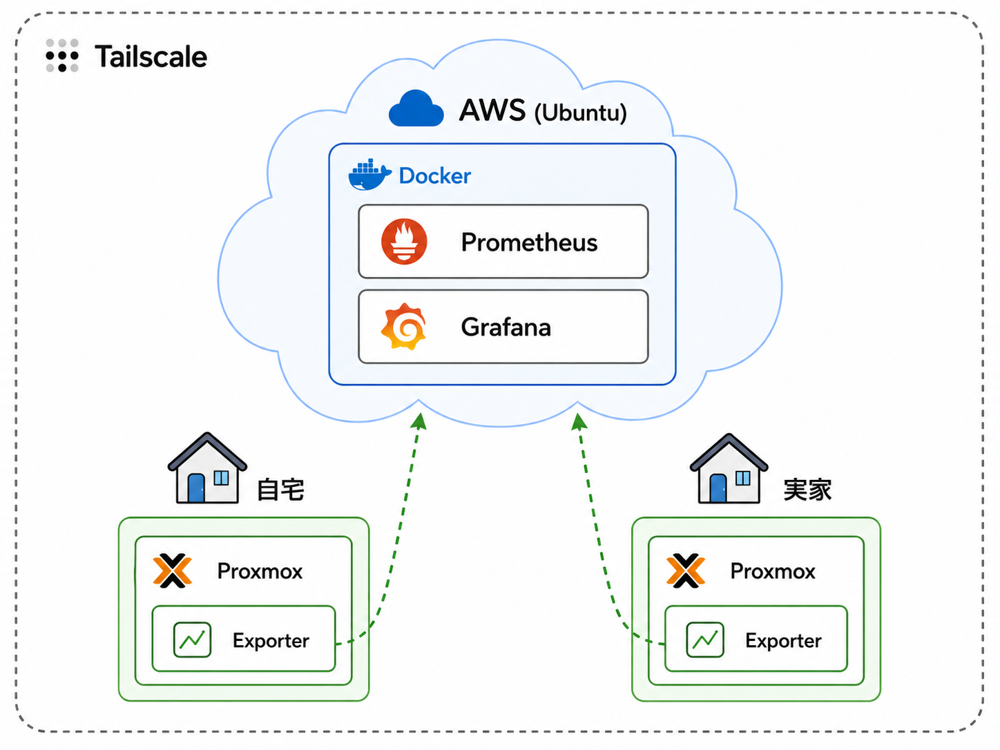
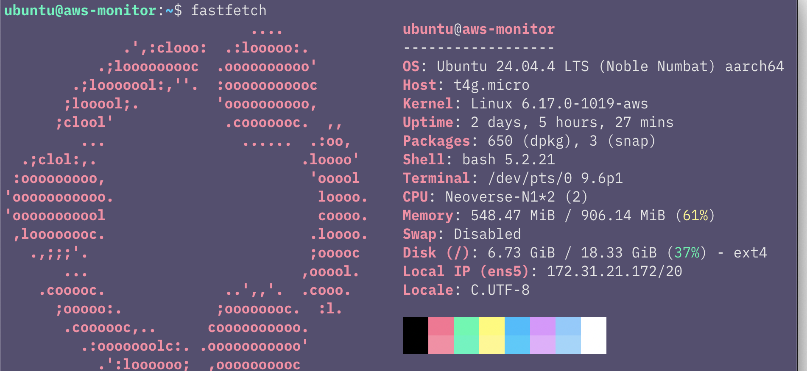
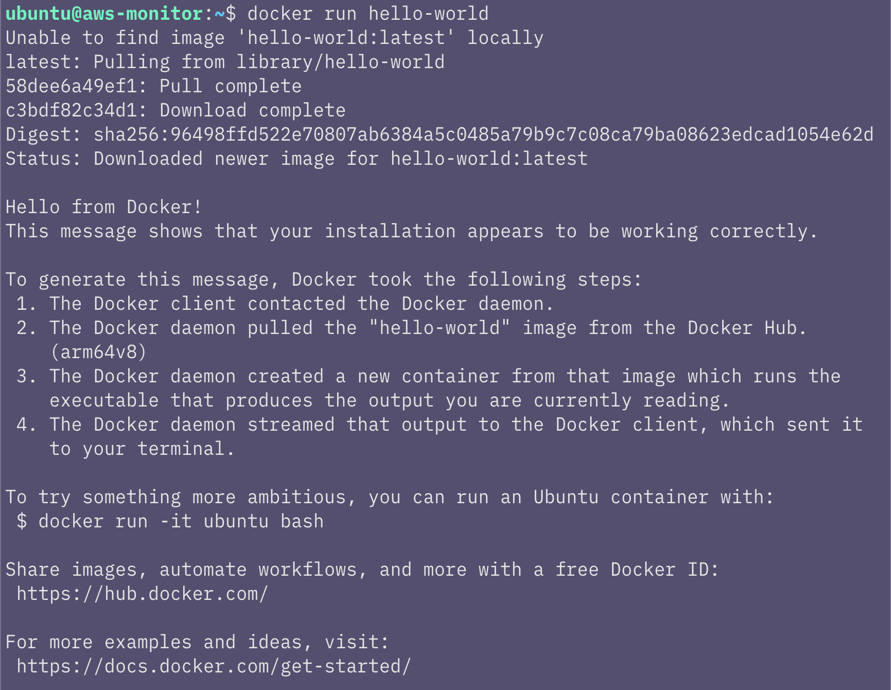

## はじめに

先日は完全サーバーレスでサイトを構築する仕組みを作成しました。

今回は自宅のサーバーを監視する環境を構築していきます。

ただし、監視サーバーも自宅に置いてしまうと、停電や回線障害、Proxmox自体のトラブルが発生した際に監視サーバーまで停止してしまいます。

そのため今回はクラウド側から自宅や実家のサーバーを監視できる環境を構築していきます。

内容が長くなりそうなので、今回は全5回のシリーズとして進めていきたいと考えています。

### シリーズ構成（予定）

1. AWSで監視サーバーの土台を作る（本記事）
2. Prometheus・Grafanaで監視サーバーを構築する
3. 監視サーバーのセキュリティを見直す
4. 監視環境を改善・運用しやすくする
5. Terraform・AnsibleでIaC化する



---

## 今回やること

今回は、AWS上に監視サーバーの最低限の土台を作ります。

具体的には、次の作業を行います。

- EC2インスタンスを作成する
- EC2にSSHで接続し、パッケージを更新する
- Tailscaleを導入してVPN接続できるようにする
- Dockerを導入し、sudoなしで実行できるようにする

次回以降、このサーバー上でPrometheusやGrafanaを動かしていく予定です。

---

## 手順

### EC2を作成する

今回は無料利用枠で利用できた Ubuntu 24.04 LTS、t4g.micro、gp3（20GB） の構成でインスタンスを作成しました。

あわせてSSH接続に利用する公開鍵ペアも新しく作成します。



設定が完了したら、インスタンスを起動します。

---

### EC2に接続してパッケージを更新する

インスタンスが起動したら、SSHで接続し、パッケージ情報を更新しておきます。

```bash
sudo apt update
sudo apt upgrade -y
```

新しく作成したインスタンスでも、利用開始時点で更新が入っていることがあるため、最初に実行しておきます。

---

### TailscaleでVPN接続する

次にTailscaleを導入します。

Tailscaleは、複数の端末を同じプライベートネットワークに参加させるような感覚で使えるVPNサービスです。

今回の目的は、AWS上の監視サーバーから自宅や実家のProxmox環境を監視することです。

ただ、自宅サーバーをインターネットに直接公開するのは避けたかったため、すでに利用していたTailscaleをそのまま採用しました。

インストールは、[Tailscale公式サイト](https://tailscale.com/download/linux) に記載されているスクリプトを実行します。

`curl -fsSL https://tailscale.com/install.sh | sh`

インストール後、Tailscaleにログインします。

`sudo tailscale up`

表示されたURLをブラウザで開き、認証を完了します。

接続状態は次のコマンドで確認できます。

`tailscale status`


---

### Dockerを導入してユーザー権限を設定する

次にDockerを導入します。

自宅環境ではProxmox上でLXCを使ったことはありますが、同じコンテナ技術であるDockerを本格的に触るのは今回が初めてです。

Dockerの詳しい仕組みや導入理由については、次回の記事で整理します。今回はまずDockerを使える状態にするところまで進めます。

[Docker公式サイト](https://docs.docker.com/engine/install/ubuntu/#install-using-the-convenience-script) に記載されている簡易インストール用スクリプトを利用しました。

`curl -fsSL https://get.docker.com | sudo sh`

しばらく待つと、Dockerのインストールが完了します。

インストールできたか確認します。

`docker --version`

バージョンが表示されればOKです。

この状態でもDockerは使えますが、通常は `docker` コマンドの実行に `sudo` が必要になります。

毎回 `sudo docker ...` と入力するのは面倒なので、現在のユーザーを `docker` グループに追加します。

`sudo usermod -aG docker $USER`

設定を反映するため、一度ログアウトし、再度SSHで接続します。

再接続後、現在のユーザーが `docker` グループに所属しているか確認します。

`groups`

表示されたグループ一覧の中に `docker` が含まれていればOKです。


その後、sudoなしでDockerを実行できるか確認します。

`docker run hello-world`

`Hello from Docker!` のようなメッセージが表示されれば、sudoなしでDockerを実行できるようになっています。



---

## まとめ

### 今回できたこと

今回は、自宅サーバー監視環境を作るための土台として、AWS上にEC2インスタンスを作成し、SSH接続、Tailscale、Dockerの導入まで行いました。

今回構築したものは次のとおりです。

- AWS EC2
- Ubuntu 24.04 LTS
- Tailscale
- Docker

Tailscaleを導入したことで、AWS上の監視サーバーから自宅・実家のサーバーへ安全に接続する準備ができました。

また、Dockerを導入したことで、次回以降PrometheusやGrafanaをコンテナとして扱う準備ができました。

### 注意点・改善点

今回はTailscaleとDockerの導入で、公式サイトに記載されているインストール用スクリプトを利用しました。

どちらも手軽に導入できる一方で、取得したスクリプトをそのまま実行する形になります。

個人の検証環境では便利ですが、本番環境や公開範囲の広いサーバーで利用する場合は、公式ドキュメントの内容を確認したうえで導入方法を選んだ方がよさそうです。

また、今回の段階では監視サーバーのセキュリティ設定までは深く触れていません。

SSHの公開範囲やGrafanaの公開方法などは、今後の記事で改めて整理していきます。

### 次回やること

次回はPrometheus・Grafanaを導入し、自宅サーバーの監視環境を構築します。

Docker HubやDocker Composeについても、実際にPrometheus・Grafanaを起動しながら整理していく予定です。
