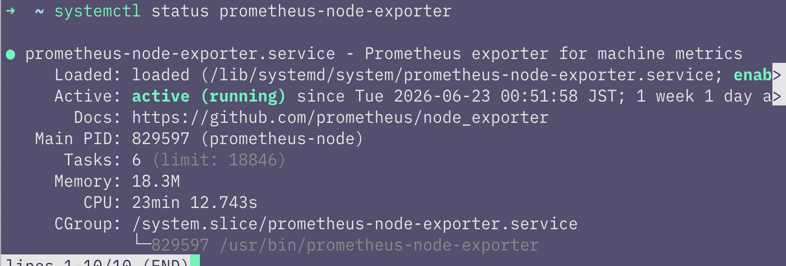
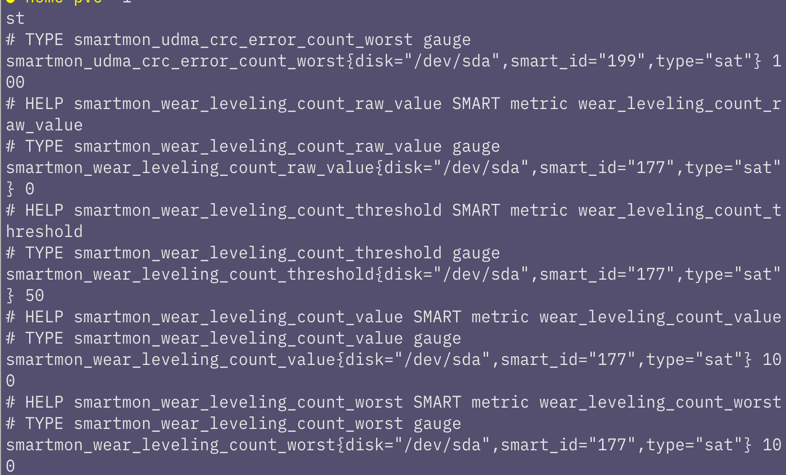
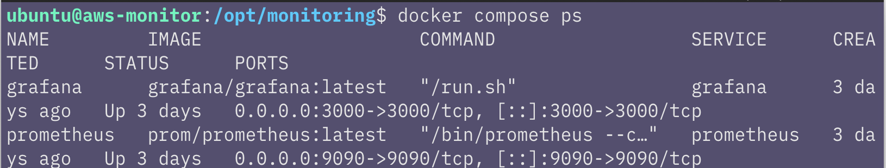
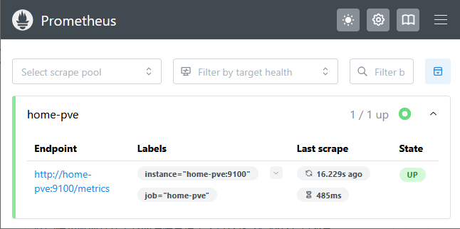
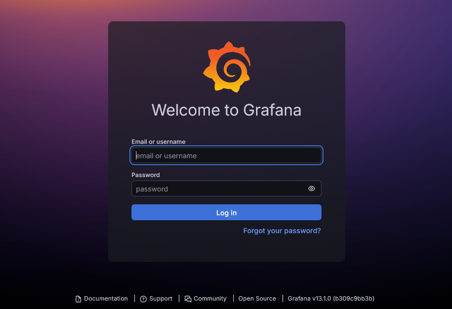
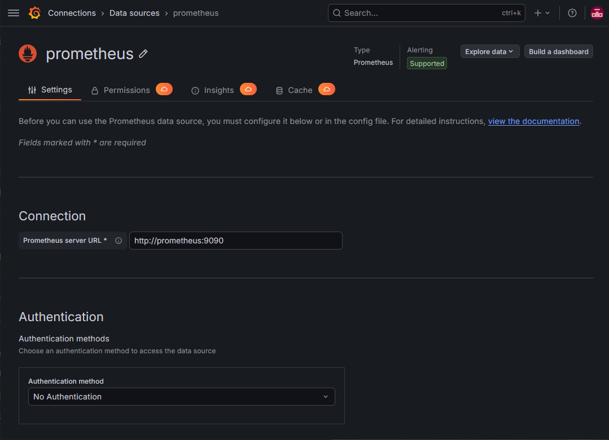
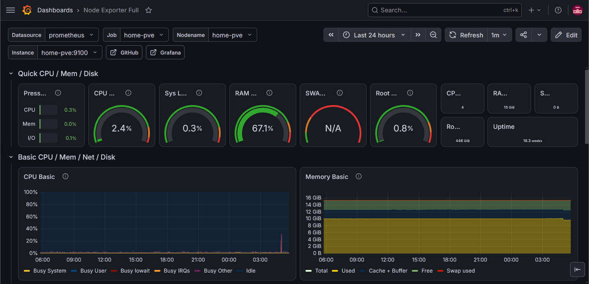

## はじめに

前回の記事では、AWS上に監視サーバーの土台を作成しました。

今回はその続きとして自宅サーバーにExporterを、AWS上の監視サーバーにPrometheusとGrafanaを導入していきます。

---

## 今回やること

今回は、AWS EC2上の監視サーバーでPrometheusとGrafanaを起動します。

具体的には、次の作業を行います。

- 自宅サーバーにNode Exporterを導入する
- Docker用の設定ファイルを作成する
- Prometheusに監視対象を登録する
- Grafanaでダッシュボードを設定する

最終的なゴールとしてPrometheusとGrafanaを起動し、監視サーバーとして使える状態を目指します。

---

## 手順

### 自宅サーバーにNode Exporterを導入する

最初に、自宅側のサーバーにNode Exporterを導入します。

Exporterとは、監視対象の情報をPrometheus向けに公開するための仕組みです。

PrometheusはExporterが公開しているメトリクスを定期的に取得しに行き、CPU使用率、メモリ使用量、ディスク使用量、ネットワーク通信量などを監視できるようにします。

今回利用するNode Exporterは、Linuxサーバーの基本的なシステム情報を取得するための仕組みです。

まず今から自宅側のサーバーにNode Exporterをインストールしていきます。

ProxmoxはDebian系の環境なのでAPTで導入しました。

```bash
sudo apt update
sudo apt install -y prometheus-node-exporter
```

インストール後、サービスの状態を確認します。

```bash
systemctl status prometheus-node-exporter
```

`active (running)` になっていればOKです。



Node Exporterは、標準では `9100` 番ポートでメトリクスを公開します。

自宅サーバー側で、次のコマンドを実行してメトリクスが返ってくるか確認します。

```bash
curl http://localhost:9100/metrics
```

大量のテキストが表示されれば、Node Exporterは動作しています。



---

### Docker用の設定ファイルを作成する

Dockerは、コンテナを動かすための仕組みで、Docker Composeは、複数のコンテナや設定を compose.yml にまとめて管理するための仕組みです。

PrometheusとGrafanaを個別に起動することもできますが、ポート設定やデータ保存先、設定ファイルの読み込み先を毎回指定するのは面倒です。

そのため今回は、Docker Composeを使ってPrometheusとGrafanaの構成をまとめて管理します。

最終的には次のような構成にします。

```text
~/monitoring
├── compose.yml
└── prometheus
    └── prometheus.yml
```
---

まず、EC2上に監視環境用のディレクトリを作成します。

```bash
mkdir -p ~/monitoring
cd ~/monitoring
```

Prometheusの設定ファイルを置くために、`prometheus` ディレクトリを作成します。

```bash
mkdir -p prometheus
```

続いて、Prometheusの設定ファイルを作成し、自宅のNode Exporterを監視対象として登録します。

```bash
vim prometheus/prometheus.yml
```

```yaml
global:
  scrape_interval: 15s

scrape_configs:
  - job_name: "home-pve"
    static_configs:
      - targets:
          - "home-pve:9100"
```

`global` では、メトリクスを収集する間隔を設定しています。今回は `scrape_interval: 15s` として、15秒ごとにメトリクスを取得する設定にしました。

`targets` には、Tailscale上で接続できる監視対象を指定します。`9100` はNode Exporterのデフォルトのポート番号です。

---

次に、PrometheusとGrafanaを起動するための `compose.yml` を作成します。

```bash
vim compose.yml
```

内容は次のようにしました。

```yaml
services:
  prometheus:
    image: prom/prometheus
    container_name: prometheus
    restart: unless-stopped
    ports:
      - "9090:9090"
    volumes:
      - ./prometheus/prometheus.yml:/etc/prometheus/prometheus.yml:ro
      - prometheus-data:/prometheus
    command:
      - "--config.file=/etc/prometheus/prometheus.yml"
      - "--storage.tsdb.retention.time=30d"

  grafana:
    image: grafana/grafana
    container_name: grafana
    restart: unless-stopped
    ports:
      - "3000:3000"
    volumes:
      - grafana-storage:/var/lib/grafana

volumes:
  prometheus-data:
  grafana-storage:
```

Prometheusには `prom/prometheus`、Grafanaには `grafana/grafana` のイメージをそれぞれDockerコンテナとして起動します。これらのイメージはDocker Hubから取得されます。

`ports` では、Prometheusを `9090`、Grafanaを `3000` でアクセスできるように設定しています。

`volumes` では、Prometheusの設定ファイルや、Prometheus・Grafanaのデータ保存先を指定しています。

また、Prometheusでは `--storage.tsdb.retention.time=30d` を指定し、データの保持期間を30日に設定しました。

設定ファイルを作成できたら、Docker Composeで起動します。

```bash
docker compose up -d
```

`-d` を付けることで、バックグラウンドでコンテナを起動できます。

起動状態を確認します。

```bash
docker compose ps
```

PrometheusとGrafanaが起動していればOKです。



---

### Prometheusに監視対象を登録する

ブラウザからTailscaleのIPにアクセスします。Prometheusは `9090` 番ポートで起動しているのでURL末尾に:`9090`を指定します。

```text
http://<aws-monitorのTailscale IP>:9090
```

Prometheusの画面が表示されれば起動は成功です。

Prometheusの画面から、`Status` → `Targets` を開くと、現在の監視対象を確認できます。

先ほど `prometheus.yml` に登録した `home-pve` が表示され、状態が UP になっていればOKです。



---

### Grafanaでダッシュボードを設定する

次にGrafanaを設定します。

Prometheusと同じくブラウザからTailscaleのIPにアクセスします。今回はポートに3000を指定します。

```text
http://<aws-monitorのTailscale IP>:3000
```

Grafanaのログイン画面が表示されればOKです。

初期ユーザー名とパスワードはどちらも `admin` です。

初回ログイン時にパスワード変更を求められるので、新しいパスワードを設定します。



Grafanaにログインしたら、Prometheusをデータソースとして追加します。

Grafanaの画面から、次のように進みます。

`Connections → Add new connection`

一覧から `Prometheus` を選択します。

URLには、GrafanaコンテナからPrometheusへアクセスするための名前を指定します。

```text
http://prometheus:9090
```

同じDocker Compose内で起動しているため、コンテナ名の `prometheus` でアクセスできます。

設定後、`Save & test` を押して接続確認します。

接続に成功すれば、GrafanaからPrometheusのデータを参照できる状態になります。



最後に、Node Exporter用のダッシュボードを読み込みます。

Grafanaでは、公開されているダッシュボードをID指定でインポートできます。

今回は、Node Exporter用のダッシュボードとしてよく利用されている `Node Exporter Full` を読み込みます。

Grafanaの画面から、`右上の＋ → Import dashboard`と進み、ダッシュボードIDに `1860` を入力します。

読み込みを進めると、データソースを選択する画面が表示されます。

ここで、先ほど追加したPrometheusを選択します。

インポートが完了すると、CPU使用率、メモリ使用量、ディスク使用量、ネットワーク通信量などを確認できるダッシュボードが表示されます。



これで、AWS上のGrafanaから、自宅サーバーのメトリクスを確認できるようになりました。

## まとめ

### 今回できたこと

今回は、AWS上の監視サーバーにPrometheusとGrafanaを導入しました。

Prometheusを使うことで、監視対象からメトリクスを収集でき、集めたデータをGrafanaに情報を渡すことでダッシュボードとして可視化できました。

### 注意点・改善点

今回はPrometheusとGrafanaを起動するために、最低限の設定だけを行いました。

Grafanaの初期パスワード変更や、外部公開範囲の制限は必ず確認する必要があります。

特にGrafanaをインターネットに直接公開する場合は、認証やアクセス制限を慎重に設定しないといけないので注意が必要です。

また、今回作成した `compose.yml` と `prometheus.yml` は、どちらもYAML形式の設定ファイルです。

YAMLはインデントに意味があるため、スペースの数や階層がずれると正しく読み込まれません。また、タブではなくスペースを使うことも重要です。

設定ファイルを編集したあとは、起動や再起動の前にインデントや階層を確認しておくと、原因の分かりにくいエラーを減らせます。

### 次回やること

次回は、監視サーバーのセキュリティを見直します。

具体的には、SSHの公開範囲、Grafanaへのアクセス方法、AWSのセキュリティグループ、Tailscale経由での管理方法などを整理していく予定です。