お久しぶりです。

全5回を予定していた自宅サーバー監視シリーズを少し放置して、最近はYAMAHA RTX830という新しいおもちゃを手に入れ、専らいじって遊んでいます。

RTX830はLAN経由でSSH接続すればCLIへログインできるので、普段の操作はとても便利です。ただし、ネットワーク設定を間違えて「自閉モード」にしてしまうと、LAN側からアクセスできなくなり、最悪の場合は初期化が必要になる可能性があります。

そこで、いざというときにも物理コンソールから操作できるよう、Amazonで安価なUSBコンソールケーブルを購入しました。

- [今回購入したUSBコンソールケーブル（Amazon）](https://www.amazon.co.jp/dp/B0991WNST6)

ケーブルを挿せばすぐに使えると思っていましたが、WindowsにCOMポートとして認識されませんでした。結論から言うと、今回はFTDIというUSBチップのドライバーをインストールする必要がありました。

手順を忘れないよう、自分用のメモも兼ねて記事に残しておきます。

## この記事の流れ

今回やったことは、大まかに次のとおりです。

1. USBコンソールケーブルを接続し、COMポートを確認する
2. FTDI CDMドライバーをインストールする
3. PuTTYへRTX830用のシリアル接続設定を登録する
4. 【おまけ】Windows Terminalから簡単に呼び出せるようにする
5. RTX830へログインする
6. 【おまけ2】MacBookからもシリアル接続する

まずはWindowsで試したときの記録から書いていきます。

> ここから先は、今回購入したFTDIチップ搭載ケーブルで試した内容です。別のチップを搭載したケーブルでは、必要なドライバーが異なるかもしれません。

## 1. COMポートが表示されているか確認する

まずUSBコンソールケーブルをRTX830とWindows PCへ接続し、デバイスマネージャーを確認します。

ここでCOMポートが確認できれば問題ないのですが、残念ながら今回の環境では「ポート（COMとLPT）」が表示されず、USBシリアルポートとして認識されていませんでした。

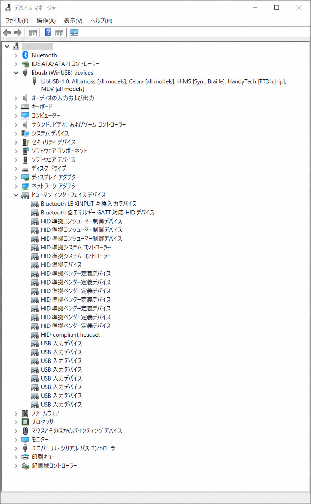

このままではシリアル接続できないため、ケーブルに搭載されているFTDIチップ用のCDMドライバーを入れます。

## 2. FTDI CDMドライバーをインストールする

[FTDI公式のVCP Driversページ](https://ftdichip.com/drivers/vcp-drivers/)から、windowsに対応するドライバーをダウンロードします。

ダウンロードしたFTDI CDM Driversのインストーラーを起動します。今回使用したバージョンは`2.12.36.20`です。

最初の画面では「Extract」をクリックし、ドライバーパッケージを展開しました。

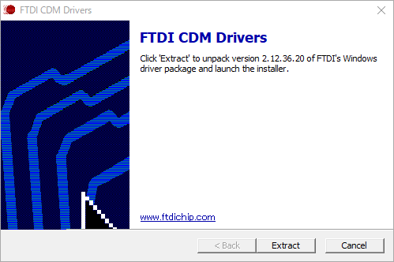

続いて起動したデバイスドライバーのインストールウィザードをそのまま「次へ」で進めて…

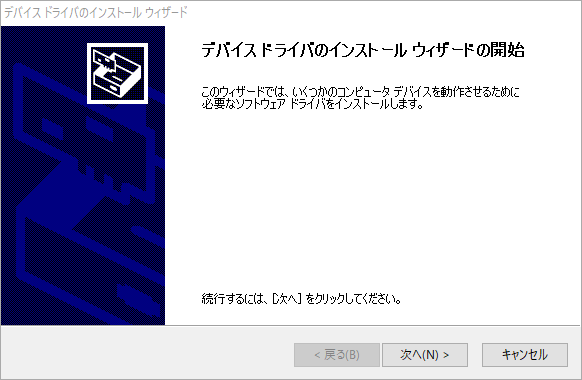

使用許諾契約を確認し、「同意します」を選択して「次へ」をクリック。

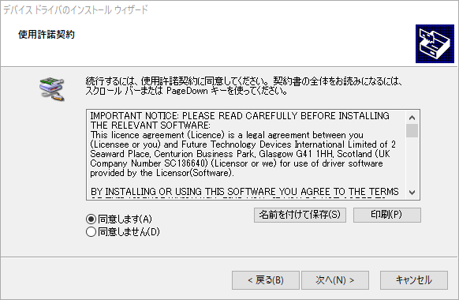

しばらく待つと、2項目とも状態が「使用できます」になりました。「完了」をクリックしてインストーラーを閉じます。

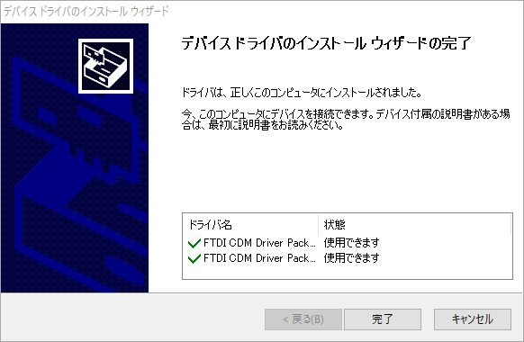

## 3. COMポート番号を確認する

ドライバーのインストール後、デバイスマネージャーを開き直してみました。

「ポート（COMとLPT）」を展開すると、`USB Serial Port (COM4)`が表示されていることが確認できます。

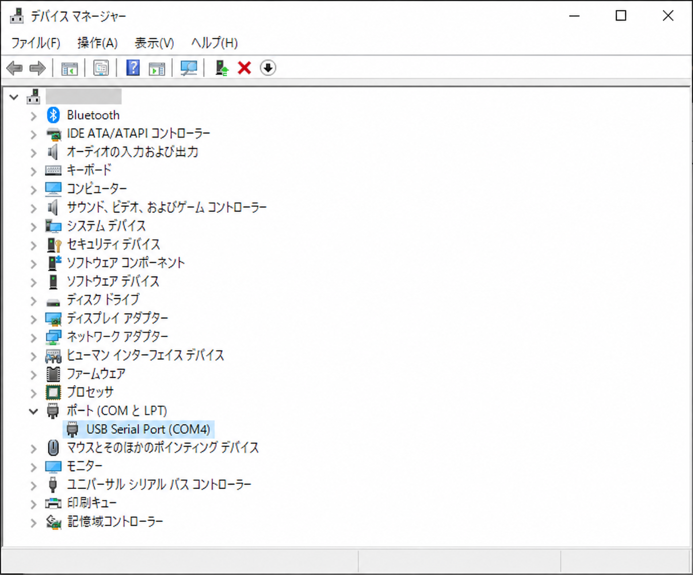

自分の環境では`COM4`でした。この番号は後ほどPuTTYの接続設定で使いますが、別の環境では違う番号になることもあります。

PowerShellから確認するなら、次のコマンドでも表示できました。

```powershell
Get-CimInstance Win32_SerialPort |
    Format-Table DeviceID, Name, Description -AutoSize
```

## 4. PuTTYをインストールする

シリアル接続に使うターミナルソフトは、PuTTYを選びました。

[PuTTYの公式ダウンロードページ](https://www.chiark.greenend.org.uk/~sgtatham/putty/latest.html)を開き、環境に合ったものを選びます。今回は`MSI ('Windows Installer')`にある`64-bit x86`をダウンロードしました。

今回インストールしたバージョンはPuTTY `0.84 (64-bit)`です。インストーラーを起動し、「Next」で進めます。

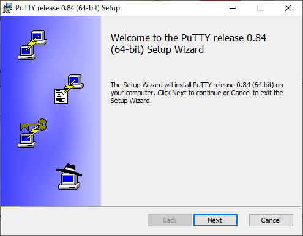

インストール先は、初期値の`C:\Program Files\PuTTY\`から変更せずに「Next」をクリック。

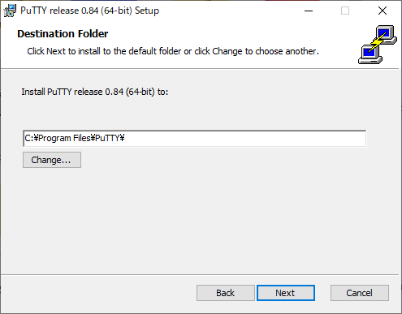

インストールする機能も変更せず、初期設定のまま「Install」を押します。

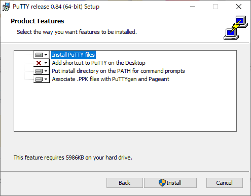

お好みで`View README file`のチェックを外し、「Finish」を選択。

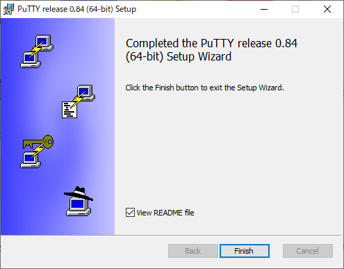

## 5. PuTTYのシリアル接続設定を保存する

PuTTYを起動し、`Session`画面を次のように設定しました。

- Serial line：`COM4`
- Speed：`9600`
- Connection type：`Serial`

`Serial line`には、先ほどデバイスマネージャーで確認した`COM4`を入力しています。

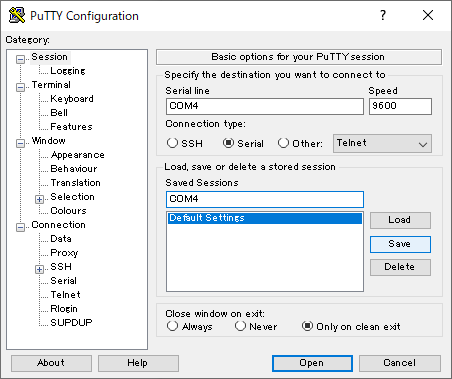

毎回入力する手間を省くため、`Saved Sessions`へ`COM4`という名前で設定を保存しました。

これで次回からは、保存したセッションを選んで「Load」をクリックするだけで同じ設定を呼び出せます。

## 6. Windows Terminalから接続できるようにする

PuTTYから直接接続するだけであればここまでの設定で十分ですが、ついでにWindows TerminalのドロップダウンからRTX830のコンソールを開けるプロファイルも追加しました。

Windows Terminalの設定を開き、次の内容で新しいプロファイルを追加します。

- 名前：`Serial-COM4`
- コマンドライン：`C:\Program Files\PuTTY\plink.exe -load "COM4"`
- アイコン：任意（今回は`plink.exe`を指定）

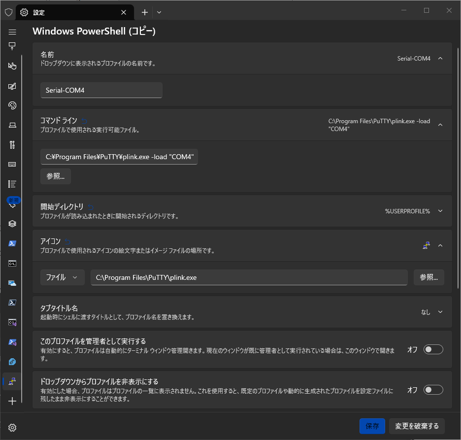

`-load`には、先ほどPuTTYの`Saved Sessions`へ保存した`COM4`を指定しています。

これでWindows Terminalのドロップダウンから`Serial-COM4`を選ぶだけでRTX830のコンソールを開けるようになります。

## 7. RTX830へログインする

Windows Terminalから`Serial-COM4`プロファイルを起動し、Enterキーを押してみましょう。

最初に`Password:`が表示されると思います。自分の環境では名前付きユーザーを設定していたので、ここでは何も入力せずにEnterキーを押し、`Username:`が表示されるところまで進めました。

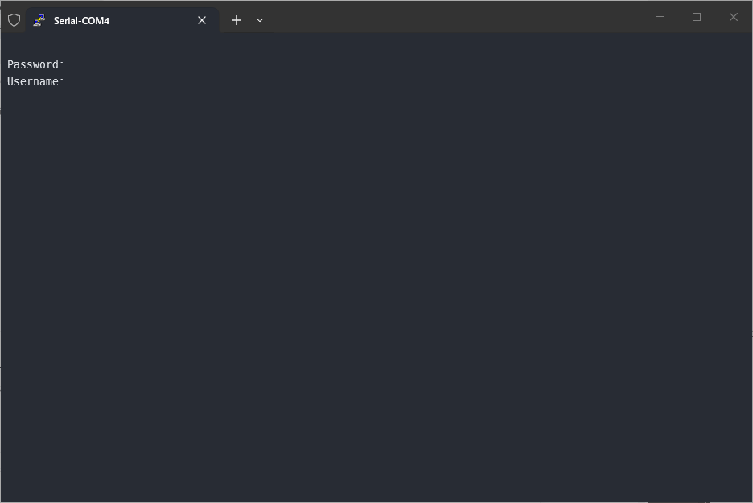

`Username:`へ登録済みのユーザー名を入力し、続いて表示された`Password:`へパスワードを入力し、ログインします。

> パスワードを入力している間、画面上には文字や記号が何も表示されませんが、そのまま入力してEnterキーを押せばログインできます。

認証に成功すると、RTX830の機種名、ファームウェアリビジョン、メモリ容量などが表示され、最後に`>`プロンプトが現れます。これでシリアルコンソールからのログインは完了です。

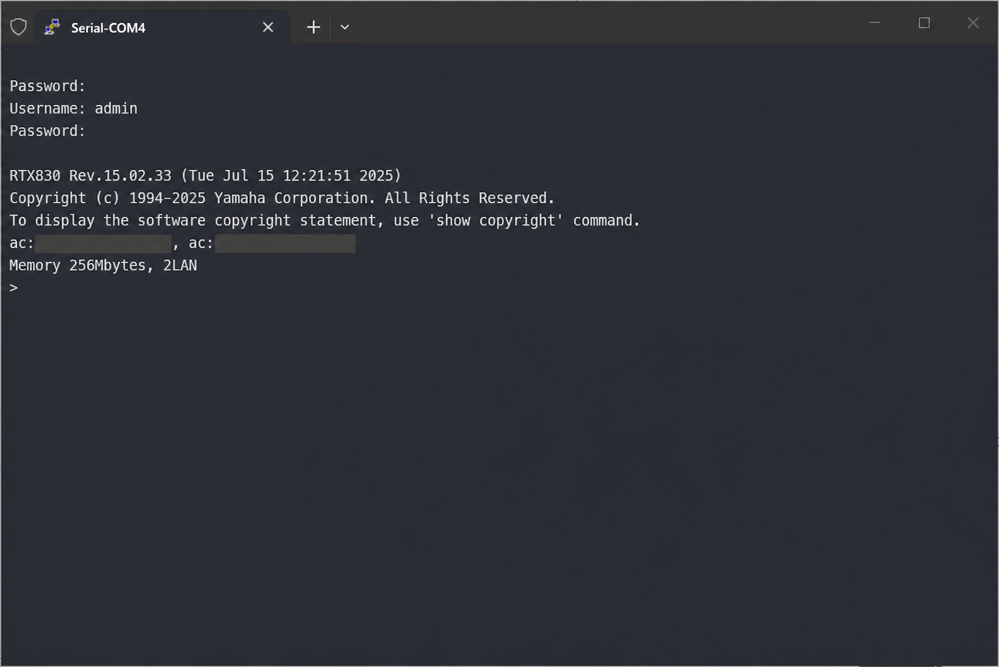

今回の環境では、`RTX830 Rev.15.02.33`が動作していることも確認できました。

## MacBookから接続する

Windows側の接続を確認したあと、同じRTX830へMacBookからも接続してみました。

WindowsではPuTTYとPlinkを使いましたが、macOSでは標準の`screen`コマンドを使いました。ログイン方法や通信速度はWindows編と同じため、ここからはMac固有のデバイス確認とドライバー導入を中心に書いていきます。

### 8. シリアルデバイスを確認する

USBシリアル変換アダプターを接続し、まずはターミナルで次のコマンドを実行しました。

```sh
ls /dev/cu.*
ls /dev/tty.*
```

最初に確認できたのは、Bluetooth用ポートとデバッグコンソールだけでした。

```text
/dev/cu.Bluetooth-Incoming-Port
/dev/cu.debug-console
/dev/tty.Bluetooth-Incoming-Port
/dev/tty.debug-console
```

期待していた`/dev/cu.usbserial-*`は見当たりません。次はUSB機器として認識されているかを確認してみます。

```sh
system_profiler SPUSBDataType |
  grep -B 4 -A 15 -i -E 'FTDI|0403|6001|Serial Converter'
```

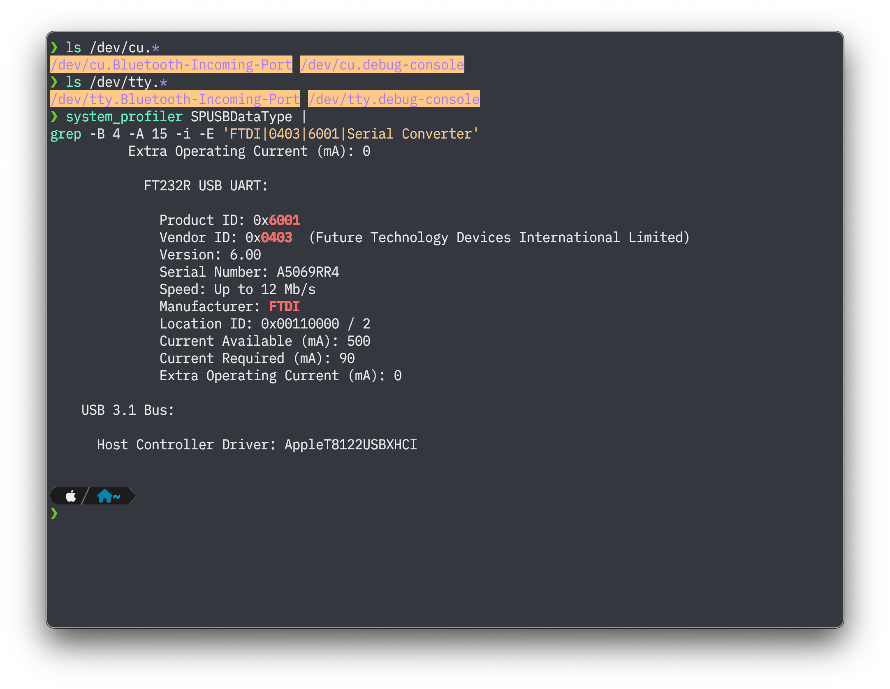

結果には`FT232R USB UART`、Product ID `0x6001`、Vendor ID `0x0403`、Manufacturer `FTDI`が表示されました。

ここまでの結果から、USB-C変換を含む物理接続は問題なさそうで、MacもFTDI FT232RをUSB機器として認識していることが分かりました。一方で仮想シリアルポートは生成されていないため、やはりWindowsと同じくFTDIのVCP（Virtual COM Port）ドライバーを入れてみます。

### 9. FTDI VCPドライバーを導入する

[FTDI公式のVCP Driversページ](https://ftdichip.com/drivers/vcp-drivers/)から、使用しているmacOSに対応するドライバーをダウンロードしました。

今回使用したインストーラーには`FTDI USB Serial Dext VCP`と表示されており、インストール操作をしても結果が`Awaiting Approval`のまま進みません。個別に拡張機能を許可する必要があるようです。

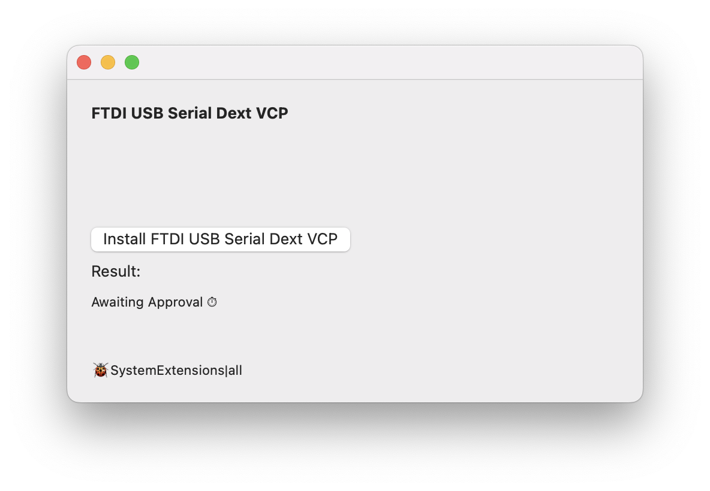

「システム設定」→「一般」→「ログイン項目と機能拡張」→「ドライバ機能拡張」を開き、`FTDIUSBSerialVCPDextInstaller.app`を有効にします。

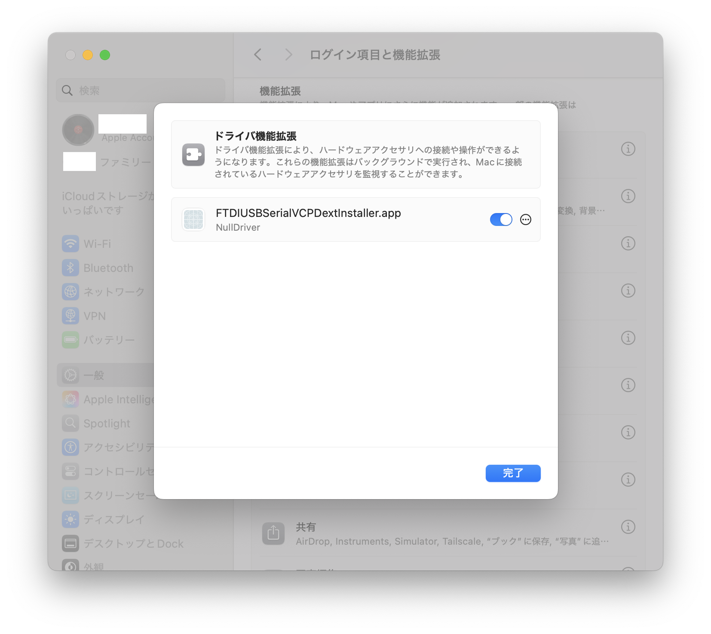

自分の環境ではこの画面から許可できましたが、macOSのバージョンによっては「システム設定」→「プライバシーとセキュリティ」に許可ボタンが出ることもあるようです。

再度インストーラーを確認すると、結果が`Succeeded`に変わっています。

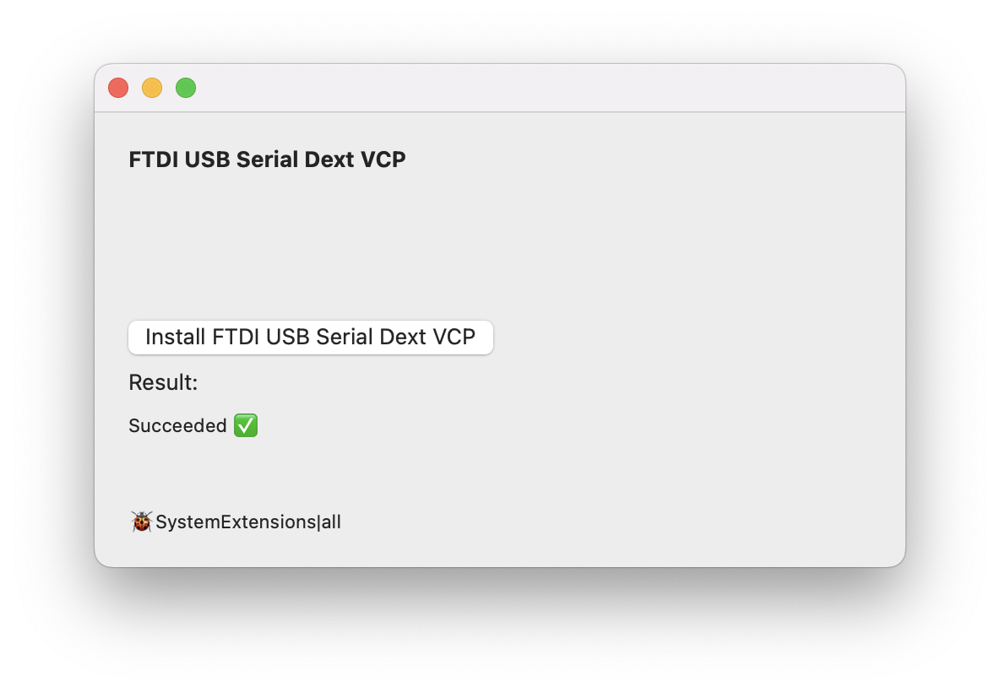

### 10. VCPドライバー導入後のデバイス名を確認する

USBシリアル変換アダプターを挿し直し、もう一度デバイスを確認してみます。

```sh
ls /dev/cu.*
ls /dev/tty.*
```

自分の環境では、次のデバイスが生成されました。

```text
/dev/cu.usbserial-A5069RR4
/dev/tty.usbserial-A5069RR4
```

末尾の`A5069RR4`は、今回使用したFTDIアダプターのシリアル番号でした。ここはアダプターごとに異なるようなので、実際に表示された名前を使います。

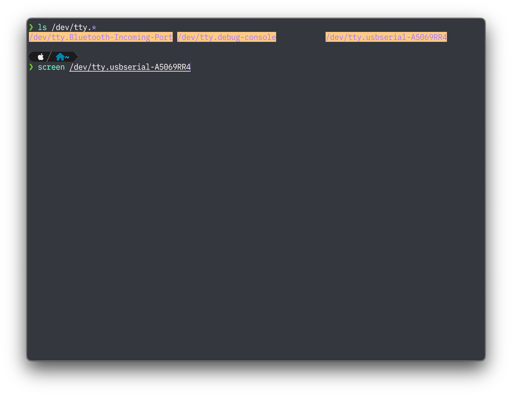

### 11. screenでRTX830へ接続する

macOS標準の`screen`コマンドを使い、確認したデバイスへ接続してみました。

```sh
screen /dev/cu.usbserial-A5069RR4
```

> もしボーレートを指定する場合は`screen /dev/cu.usbserial-A5069RR4 9600`このように、最後にスペースを空けて追記してあげる必要があるようです。9600bpsに限りデフォルトで省略できるようなので今回は省略しました。

接続後にEnterキーを押すと、RTX830のログインプロンプトが表示されます。

ログイン方法は[Windows編](#7-rtx830へログインする)と同じだったので割愛します。

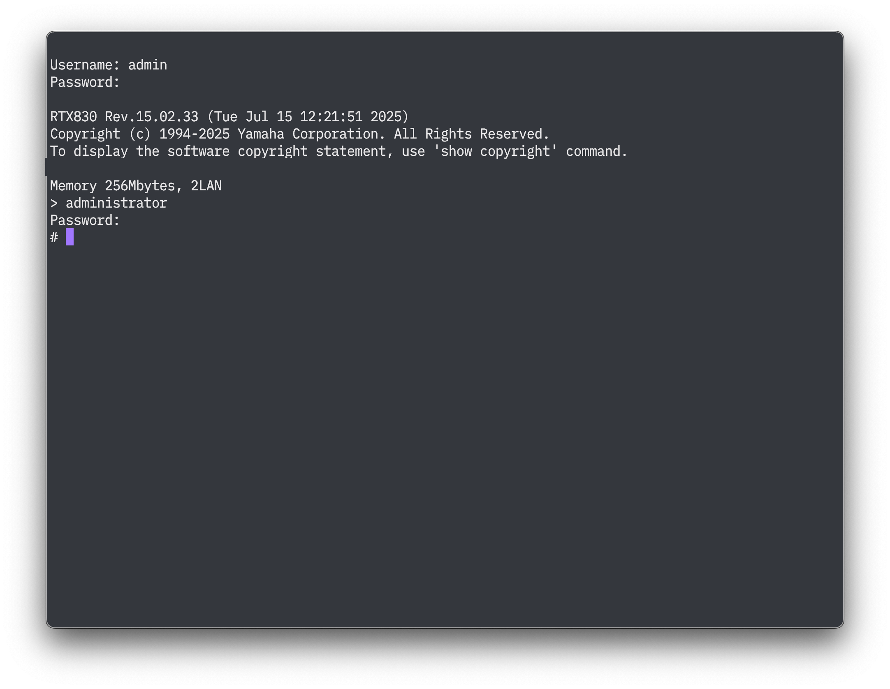

### 12. screenを終了する

作業が終わったあとは、RTX830側で`quit`を実行してログアウトしました。その後、次の順にキーを入力すると`screen`も終了できます。

1. `Ctrl+A`
2. `K`
3. `y`

`screen`だけ終了したいときも、同じキー操作が使えます。

## おわりに

今回、WindowsとMacBookのどちらでも引っかかったのは、FTDI FT232Rを仮想シリアルポートとして使うためのVCPドライバーでした。

WindowsではCOM番号を確認してPuTTYへ設定を保存し、Macでは`/dev/cu.usbserial-*`を確認して`screen`から接続できました。名前付きユーザーでログインするため、最初の`Password:`を空のままEnterキーで送ったところも共通です。

一度ドライバーと接続方法を整えておけば、LAN側の設定を誤ってSSHで接続できなくなった場合でも物理のコンソールから復旧作業を進められるので安心ですねー
